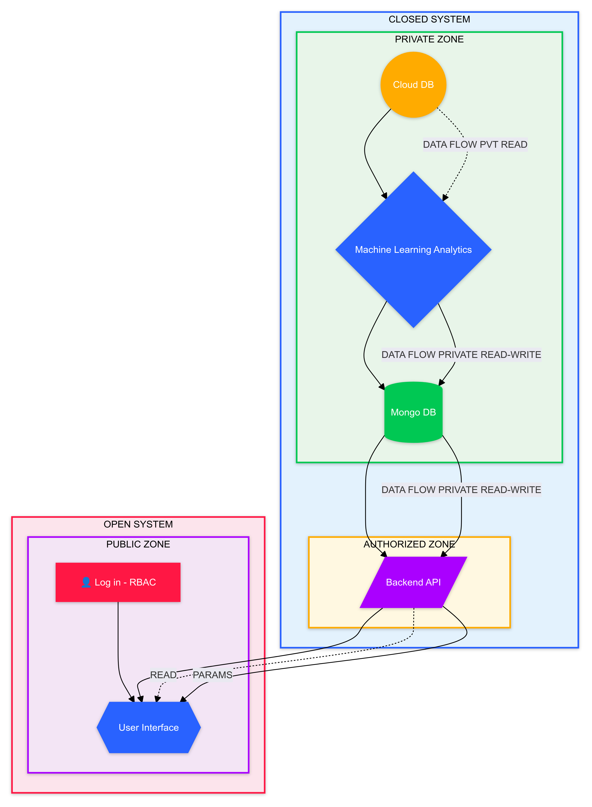

# CONFSEC - EITACIES INC Summer Internship Project

## Project Overview
During my internship at EITACIES INC, I developed and deployed machine learning models designed to enhance the security and integrity of video conferencing platforms like Zoom, Webex, and Teams. The project, CONFSEC, focuses on detecting and managing risks in real-time, ensuring that virtual meetings are secure from potential threats such as inappropriate content and sensitive information leaks.

## Goals and Objectives
- **Primary Objective:** Develop machine learning models to identify and flag potential risks in virtual meetings.
- **Key Focus Areas:**
  - PCI DSS compliance detection
  - Racial discrimination detection
  - Facial expression analysis
  - Gender discrimination detection

## Responsibilities
- **Understanding Business Objectives:** Developed models aligned with business goals related to safeguarding video conferences.
- **Algorithm Analysis:** Analyzed and ranked ML algorithms based on their effectiveness in solving identified problems.
- **Data Exploration:** Explored and visualized data to understand its distribution and potential impact on model performance.
- **Data Quality Assurance:** Verified data quality through cleaning processes and managed data acquisition when necessary.
- **Model Training & Tuning:** Trained models, fine-tuned hyperparameters, and deployed them in a real-world environment.
- **Error Analysis:** Analyzed model errors and devised strategies to mitigate them.

## Architecture
The CONFSEC project architecture is designed for secure and efficient data processing. The machine learning engine processes data within a secure zone, and results are stored in MongoDB. The backend API securely interacts with the user interface via role-based access control (RBAC).

## Key Tasks
### 1. PCI DSS Detection Using Text
- **Overview:** Detected sensitive PCI DSS information in virtual meeting text data.
- **Techniques:** Custom TF-IDF vectorization, Logistic Regression, and Decision Trees.
- **Accuracy:** 98%

### 2. Racial Discrimination Detection
- **Overview:** Flagged instances of racial discrimination in video conference conversations.
- **Techniques:** NLP with custom word embeddings, SVM models.
- **Accuracy:** 94.44%

### 3. Facial Expression Analysis
- **Overview:** Analyzed facial expressions to detect inappropriate behavior during meetings.
- **Techniques:** Convolutional Neural Networks (CNNs).
- **Accuracy:** 60%

### 4. Gender Discrimination Detection
- **Overview:** Identified instances of gender discrimination in virtual meetings.
- **Techniques:** BERT-based NLP for contextual understanding.
- **Accuracy:** 99.7%

## Skills Utilized and Developed
- **Machine Learning:** Logistic Regression, Decision Trees, SVM, CNN, BERT
- **NLP:** Text Vectorization, Word Embeddings, Sentiment Analysis, Bias Detection
- **Data Processing:** Cleaning, Augmentation, Custom Pipelines
- **Programming:** Python, Scikit-Learn, TensorFlow, MongoDB, Git/GitHub

## Challenges and Learning
- **Model Overfitting:** Managed overfitting through regularization, hyperparameter tuning, and cross-validation.
- **Data Collection:** Addressed challenges in obtaining high-quality data by generating synthetic data and applying robust validation strategies.

## Conclusion
This internship provided invaluable hands-on experience in machine learning, enabling me to apply theoretical knowledge to real-world problems. The skills and insights gained have significantly enhanced my understanding of ML applications and prepared me for future challenges in the field.

## Repository
For detailed code and implementation, visit the [GitHub Repository](https://github.com/nihith-nath/Eitacies_ML_internship_project).

---

*Authored by Nihith Nath Kandikattu - Machine Learning Engineer Intern, EITACIES INC.*
